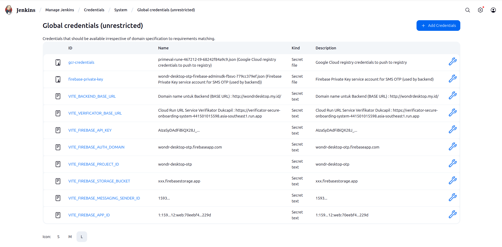

# Experiment Jenkins

**Langkah 0** : Buat Volume untuk Jenkins

```bash
docker volume create jenkins-data

docker run --name jenkins -p 8080:8080 -p 50000:50000 -v jenkins-data:/var/jenkins_home jenkins/jenkins:lts
```

**Langkah 1** : Siapkan container Jenkins (customer)

```bash
# build customer docker image for jenkins (docker installed inside)
docker build -t my-jenkins:lts -f Dockerfile.jenkins .

# remove old plain jenkins (if exists)
docker stop jenkins
docker rm jenkins

# cek ID group docker di host
getent group docker

# run the custom jenkins image
# APABILA JENKINS FILE DIJALANKAN SECARA LOCAL
docker run \
  --name jenkins \
  -p 8080:8080 \
  -p 50000:50000 \
  -v jenkins-data:/var/jenkins_home \
  -v /var/run/docker.sock:/var/run/docker.sock \
  --group-add 1001 \
  my-jenkins:lts

# APABILA JENKINSFILE DIJALANKAN DI VIRTUAL MACHINE (GOOGLE CLOUD)
docker run -d -p 8080:8080 -p 50000:50000 \
  -v jenkins-data:/var/jenkins_home \
  -v /var/run/docker.sock:/var/run/docker.sock \
  --user 1000:412 \
  --name jenkins \
  asia.gcr.io/primeval-rune-467212-t9/wondr-desktop-jenkins:1.0
  
```

**Langkah 2** : Install plugins dan atur credentials

- Agar build bisa ter-trigger dari Github:
  - Docker Pipeline
    - Manage Jenkins > Manage Plugins > `Docker Pipeline`
  - NodeJS
    - Manage Jenkins > Manage Plugins > NodeJS Plugin > tools
      - node18
      - v18.19.1
  - Jdk
    - jdk21
    - automatically

- Agar docker build & push ke registry sukses
  - upload `.json` (secret key service accounts) ke jenkins secrets
    - ID : `gcr-credentials`
  - tambahkan jenkins ke group
    - `grep '^docker:' /etc/group`
    - contoh output : `docker:!:412:chronos,bostangsteiitb2020` 

**Langkah 3** : Buat new build (pipeline), tambahkan GithubSCM (agar baca Jenkinsfile dari repo)

```bash
docker build -t asia.gcr.io/primeval-rune-467212-t9/wondr-desktop-jenkins:1.0 -f Dockerfile.jenkins .

docker push asia.gcr.io/primeval-rune-467212-t9/wondr-desktop-jenkins:1.0
```

## Kredensial yang harus disimpan



## Troubleshooting VM

1. Proses build Jenkins tidak kunjung selesai

```bash
# apabila ada proses build yang tidak selesai-selesai
# -> kemungkinan karena storage kurang
# SSH ke dalam VM lalu 
df -h

# solusi : tambahkan storage
```

2. Docker socket tdk bisa diakses

```bash
# cek ID group docker di host
getent group docker # ubuntu
grep '^docker:' /etc/group    # debian

# run the custom jenkins image
# APABILA JENKINSFILE DIJALANKAN DI VIRTUAL MACHINE (GOOGLE CLOUD)
docker run -d -p 8080:8080 -p 50000:50000 \
  -v jenkins-data:/var/jenkins_home \
  -v /var/run/docker.sock:/var/run/docker.sock \
  --user 1000:412 \
  --name jenkins \
  asia.gcr.io/primeval-rune-467212-t9/wondr-desktop-jenkins:1.0

docker stop jenkins
docker rm jenkins
docker run -p 8080:8080 -p 50000:50000 \
  -v jenkins-data:/var/jenkins_home \
  -v /var/run/docker.sock:/var/run/docker.sock \
  --user 1000:412 \
  --name jenkins \
  asia.gcr.io/primeval-rune-467212-t9/wondr-desktop-jenkins:1.0
```
