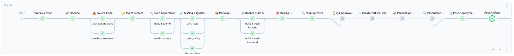
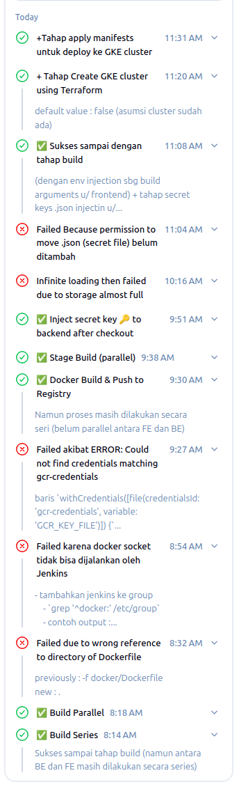

# Panduan CI/CD Pipeline Jenkins

Dokumen ini merangkum konfigurasi dan alur kerja pipeline CI/CD untuk aplikasi frontend dan backend menggunakan Jenkins, Docker, dan Google Cloud.

## Struktur Pipeline

Pipeline ini diimplementasikan menggunakan Jenkins Declarative Pipeline dan terdiri dari beberapa tahap (stages) yang terstruktur.

### Visualisasi Pipeline



* **Checkout SCM**: Checkout repositori Jenkinsfile.
* **Pipeline Initialization**: Mengatur variabel lingkungan dan notifikasi awal.
* **Source Code Checkout**: Mengambil kode sumber dari repositori backend, frontend, dan ops. Tahap ini diparalelkan untuk checkout `backend-repo` dan `frontend-repo` agar lebih efisien.
* **Inject Secrets**: Menginjeksikan private key Firebase dari Jenkins Credentials ke direktori `backend-repo/src/main/resources`.
* **Build Application**: Membangun aplikasi backend (Maven) dan frontend (Node.js). Tahap ini juga diparalelkan.
* **Testing & Quality Analysis**: Menjalankan pengujian unit, analisis kualitas kode, dan pemindaian keamanan secara paralel.
* **Package Application**: Mengemas aplikasi yang sudah selesai dibangun.
* **Docker Build & Registry**: Membangun image Docker untuk backend dan frontend, kemudian mendorongnya ke Google Container Registry (GCR). Proses ini juga berjalan secara paralel.
* **Staging Deployment**: Menerapkan image Docker ke lingkungan staging.
* **Staging Tests**: Menjalankan tes integrasi di lingkungan staging.
* **QA Approval**: Menunggu persetujuan QA sebelum melanjutkan ke deployment produksi.
* **Create GKE Cluster**: Tahap opsional yang membuat cluster GKE baru menggunakan Terraform. Tahap ini dilewati (ditandai dengan panah) jika parameter tidak diaktifkan.
* **Production Deployment**: Menerapkan manifest Kubernetes ke GKE.
* **Production Verification**: Verifikasi keberhasilan deployment produksi.
* **Post-Deployment Report**: Menghasilkan laporan akhir deployment.
* **Post Actions**: Membersihkan workspace setelah pipeline selesai.

## Langkah-langkah Implementasi

### Langkah 1: Persiapan Lingkungan Jenkins

1. **Buat Volume Docker untuk Jenkins**:

    ```bash
    docker volume create jenkins-data
    ```

2. **Siapkan Docker Image Jenkins dengan Docker-in-Docker**:
      * Buat `Dockerfile.jenkins` yang menginstal Docker CLI.
      * Bangun image:

        ```bash
        docker build -t my-jenkins:lts -f Dockerfile.jenkins .
        ```

      * Dorong ke Container Registry (jika menggunakan GKE/VM):

        ```bash
        docker tag my-jenkins:lts asia.gcr.io/primeval-rune-467212-t9/wondr-desktop-jenkins:1.0
        docker push asia.gcr.io/primeval-rune-467212-t9/wondr-desktop-jenkins:1.0
        ```

3. **Jalankan Jenkins Container**:
      * Hentikan dan hapus container lama:

        ```bash
        docker stop jenkins && docker rm jenkins
        ```

      * Dapatkan GID (Group ID) `docker` di host:

        ```bash
        getent group docker # atau `grep '^docker:' /etc/group` di beberapa distro Linux
        ```

      * Jalankan container, pastikan `jenkins` user memiliki akses ke Docker socket.
      * **Untuk Local (dengan group ID dinamis):**

        ```bash
        docker run \
          --name jenkins \
          -p 8080:8080 -p 50000:50000 \
          -v jenkins-data:/var/jenkins_home \
          -v /var/run/docker.sock:/var/run/docker.sock \
          --group-add $(getent group docker | cut -d: -f3) \
          my-jenkins:lts
        ```

      * **Untuk VM (contoh user ID 1000, GID 412):**

        ```bash
        docker run -d -p 8080:8080 -p 50000:50000 \
          -v jenkins-data:/var/jenkins_home \
          -v /var/run/docker.sock:/var/run/docker.sock \
          --user 1000:412 \
          --name jenkins \
          asia.gcr.io/primeval-rune-467212-t9/wondr-desktop-jenkins:1.0
        ```

### Langkah 2: Konfigurasi Jenkins

1. **Install Plugins**:
      * Manajemen Git, Docker Pipeline, NodeJS Plugin, dan JDK Tool.
2. **Konfigurasi Tools**:
      * **NodeJS**: Tambahkan NodeJS versi `v18.19.1` dengan nama `node18`.
      * **JDK**: Tambahkan JDK versi `jdk21` dengan nama `jdk21`.
3. **Simpan Credentials**:
      * **GCR Credentials**: Simpan Service Account Key JSON sebagai **Secret file** dengan ID `gcr-credentials`. Kredensial ini juga akan digunakan untuk otentikasi `gcloud` dan Terraform.
      * **Firebase Private Key**: Simpan Firebase Admin SDK JSON sebagai **Secret file** dengan ID `firebase-private-key`.
      * **Firebase & Backend ENV Vars**: Simpan variabel lingkungan sensitif untuk frontend (seperti `VITE_FIREBASE_API_KEY`) sebagai **Secret text** dengan ID yang sesuai.


### Langkah 3: Eksekusi Pipeline

1. Buat Jenkins Pipeline baru dan konfigurasikan untuk membaca `Jenkinsfile` dari repositori Git.
2. Pipeline akan berjalan secara otomatis berdasarkan konfigurasi di `Jenkinsfile`.

## Troubleshooting

1. **Proses Build Jenkins Tidak Kunjung Selesai**:
      * **Penyebab**: Ruang disk di VM Jenkins kemungkinan penuh.
      * **Diagnosis**: Jalankan `df -h` via SSH untuk memeriksa penggunaan disk.
      * **Solusi**: Hentikan VM, tingkatkan ukuran disk di Google Cloud Console, lalu nyalakan kembali VM.
2. **`Permission denied` saat Menyalin File**:
      * **Penyebab**: User Jenkins tidak memiliki hak tulis di direktori target (`src/main/resources`).
      * **Solusi**: Tambahkan perintah `sh 'chmod -R 777 src/main/resources'` sebelum menyalin file untuk memastikan izin tulis.
3. **Akses Jaringan atau IP Berubah**:
      * **Penyebab**: Alamat IP eksternal VM masih ephemeral (dinamis).
      * **Solusi**: Ubah alamat IP eksternal VM menjadi statis (reserved) di Google Cloud Console.

## Catatan

Tambahkan deskripsi yang jelas untuk setiap build history (baik sukses maupun gagal) untuk mempermudah devops melakukan troubleshooting.


